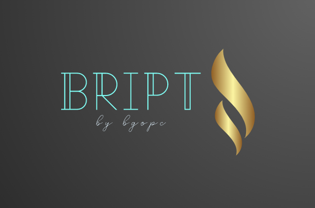

# Bript

This is a basic programming language with the minimalist arithmetics and some basic function like print, etc

made by bgopc

continuation from [PePc](https://github.com/petranol/PePCscript)

